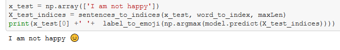

### Readme- Emojifier

#### Brief Description-
- This makes our text messages more expressive by finding the most appropriate emoji to be used with a sentence. Here we are using pre-trained word embeddings to represent words and later feed it to LSTM to predict the appropriate emoji.

#### Methods Used-
- Word embeddings
- LSTM
- Dropout Regularization

#### Technologies Used-
- Python
- Keras
- Numpy
- Matplotlib

#### Getting Started-
- Just clone the entire repo and run the Jupyter Notebook.

#### Output-
- 
- [Rest the output can be seen in Jupyter Notebook](https://github.com/gadia-aayush/Emojifier/blob/master/emojify.ipynb).
